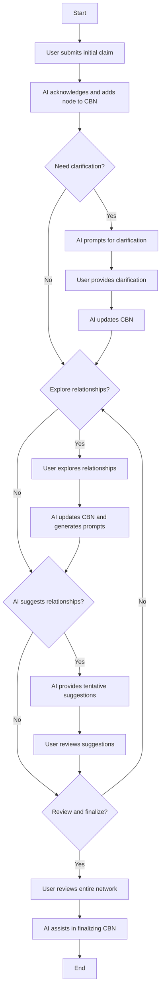

# cnbing

## **Introduction**

Covalence Labs is developing a prototype for constructing **Causal Bayesian Networks (CBNs)** through AI-facilitated dialogue. The system enables users to iteratively refine, clarify, and decompose complex claims into a structured causal framework. As users articulate and discuss claims with the AI chatbot, a comprehensive visual representation of the causal structure emerges, embodying the essence of a CBN.

This document serves as a detailed guide for the development team and as a conceptual reference for stakeholders, outlining the objectives, expected user interactions, and core functionalities of the prototype.

## **Purpose**

The principal objective of this prototype is to facilitate **conversational exploration and iterative refinement of complex claims**. Through a dynamic interaction with an AI system, users can submit high-level assertions, deconstruct them into constituent subclaims, and establish causal linkages. As these discussions advance, the AI autonomously constructs a **Causal Bayesian Network (CBN)** to represent the user's system of claims in a formalized manner.

The system empowers stakeholders to systematically organize and formalize intricate ideas, employing an intuitive conversational interface that does not necessitate specialized technical knowledge.

## **Objectives**

- **Claim Clarification**: Enable users to engage with the AI to clarify, refine, and decompose submitted claims into constituent components.
- **Emergent Causal Modeling**: Allow the CBN to evolve organically based on the iterative clarification and refinement of claims.
- **User Guidance**: Provide context-sensitive prompts for guidance and reflection, ensuring that the relationships between claims are explicit and logically consistent.
- **Simple User Interface**: Offer a streamlined conversational UI coupled with a dynamic visual representation of the evolving causal model.
- **Error Handling**: Integrate mechanisms for automatic error detection, clarification prompts, and tentative AI-generated suggestions for incomplete relationships.

## **Scope of Functionality**

### **Conversational Interaction**

The core interaction entails an ongoing dialogue between the user and the AI, focused on exploring claims and elucidating their causal relationships. The chatbot will facilitate the following activities:

- **Submit Claims**: Users can articulate claims, which may include statements, hypotheses, or causal assertions. Example: "AI robustness affects system failure risk."
- **Refine Claims**: The AI assists in disambiguating claims, breaking down complex concepts, and ensuring the clarity and precision of submitted assertions. Example: "What precisely do you mean by 'robustness'?"
- **Facilitate Reflection**: The AI prompts users to reflect on the interdependencies among claims, encouraging exploration of broader causal influences. Example: "Should 'data integrity' also influence 'AI robustness'?"
- **Handle Tentative Details**: The AI proposes provisional relationships or missing elements, marking these for subsequent user confirmation or refinement.

### **Causal Bayesian Network Construction**

The **Causal Bayesian Network (CBN)** evolves based on the claims and their inferred relationships discussed in the conversation:

- **Nodes**: Each primary claim or subclaim is represented as a node within the CBN. For example, "AI robustness" is depicted as a node connected to other relevant nodes.
- **Edges**: Directed edges represent causal linkages, showing how one claim influences another. Example: A directed edge from "Goal Misalignment" to "System Failure Risk" indicates a direct causal influence.
- **Subclaims**: Complex claims are deconstructed into subclaims, with their respective relationships represented as interconnected nodes and edges.

### **Graphical Visualization**

- **Real-Time Visualization**: The evolving CBN is depicted in a dynamic graph adjacent to the chatbot, providing a comprehensive visual overview of the system of claims.
- **Interactive Elements**: Users can interact with the graphical representation by:
    - **Clicking on Nodes**: Viewing or modifying specific details related to a claim.
    - **Clicking on Edges**: Adjusting or clarifying the causal relationships between nodes.
- **Responsive Layout**: The layout of the network dynamically adapts as new claims are added or existing ones are modified, ensuring continuous legibility and logical coherence.

### **Error Handling and AI Autonomy**

- **Error Handling**: The AI aids in identifying and resolving inconsistencies or ambiguities within the claim system, such as circular logic or vague relationships.
    - Example: "There appears to be a circular dependency between 'Transport Issues' and 'Supplier Risk.' Could you clarify this relationship?"
- **Autonomous Suggestions**: The AI provides tentative suggestions to complete partially defined relationships, which are flagged for user review and confirmation.
- **Reflection Prompts**: The AI actively engages users to reflect on underdefined aspects of their claims, promoting completeness and consistency within the model.

## **User Journeys**

### **General User Journey: Claim Refinement and CBN Construction**

1. **Initial Claim Submission**
    - **User Action**: Submit one or multiple initial claims (e.g., "AI robustness affects system failure risk").
    - **System Response**: The AI acknowledges the submission and incorporates the claim as a node in the emerging CBN.
2. **Refinement and Clarification**
    - **User Action**: Users are prompted to provide additional context or clarify ambiguous claims.
    - **System Response**: The AI disaggregates the claim into subclaims or poses targeted questions, subsequently adding nodes and edges to the CBN.
3. **Exploring Causal Relationships**
    - **User Action**: Users explore relationships among claims, identifying new connections or refining existing ones.
    - **System Response**: The AI updates the visual graph and generates reflection prompts to ensure coherence in the model.
4. **Tentative Suggestions**
    - **User Action**: Users may leave certain relationships unspecified.
    - **System Response**: The AI provides tentative causal suggestions, marking them as pending user confirmation.
5. **Review and Finalization**
    - **User Action**: Users review the entire claim network, confirming tentative relationships.
    - **System Response**: The AI assists in finalizing the CBN, highlighting gaps or inconsistencies for further user examination.

### **Use Case: Collective Reflection on the RIZ Supply Chain**

**Objective**: To collaboratively refine the **RIZ Causal Bayesian Network**, modeling the supply chain from biomass sourcing to carbon black production.

- **Submit Initial Claims**: Users provide broad claims, such as "Biomass supply affects carbon black production."
- **Clarify and Refine**: The AI prompts for more specific subclaims or clarifications (e.g., "Does transport efficiency affect production directly?").
- **Break Down Subclaims**: Complex claims are decomposed into manageable subclaims, such as "Biomass availability impacts transport costs."
- **Reflect on the Network**: The team collaboratively reviews the evolving network, identifying key dependencies, bottlenecks, and leverage points.
- **Tentative Relationships**: The AI suggests additional relationships, marking them as tentative until confirmed.

**Outcome**: A refined CBN that elucidates the relationships within the RIZ supply chain, facilitating enhanced understanding and decision-making.

### **Use Case: Modeling AI Safety Claims**

**Objective**: To refine claims regarding **AI safety risks**, with a particular focus on robustness, data integrity, and failure mitigation.

- **Initial Claim Submission**: Users submit overarching claims, such as "AI robustness influences failure risk."
- **Clarification and Decomposition**: The AI dissects the claim into subclaims, such as "Data integrity affects robustness."
- **Define Relationships**: Users and the AI collaboratively establish causal relationships between claims, such as "Goal alignment impacts system safety."
- **Review and Improve**: The network is examined to identify areas requiring further exploration or additional causal relationships.

**Outcome**: A coherent, structured causal model that clarifies the relationships between various AI safety concerns, facilitating targeted mitigation strategies.

## **Non-Functional Requirements**

- **Performance**: The system must handle networks comprising up to 1000 nodes and edges efficiently.
- **Error Handling**: The AI should proactively identify and resolve inconsistencies, providing prompts for clarification and auto-correcting minor issues.
- **Maintainability**: The system must be modular, allowing for straightforward updates and enhancements.
- **Security**: Security measures will prioritize basic data integrity and privacy, given the non-sensitive nature of the prototype.

## **Conclusion**

This specification delineates a conversational framework where users engage with an AI to iteratively refine and clarify complex systems of claims. Through the conversational process, the AI incrementally constructs a **Causal Bayesian Network (CBN)**, translating the claims into a structured, visual causal model. This approach facilitates comprehensive reflection, understanding, and collaboration among stakeholders, ultimately advancing collective intelligence. The emphasis is placed on maintaining simplicity, fostering intuitive interaction, and enabling the emergent modeling of intricate relationships.

## Appendix: Why CBNs

We chose **Causal Bayesian Networks (CBNs)** for this prototype because of their unique ability to represent **causal relationships** between variables while accounting for **uncertainty**—an essential feature for capturing the complex, interdependent claims our system will handle. Unlike other formalisms such as **First-order Logic** or **Argumentation Frameworks**, which focus on strict logical relations or structured debate, CBNs provide a framework that integrates both **probabilistic reasoning** and **causal inference**. This enables our system to model not only whether one claim influences another but also how likely such influence is, given the inherent uncertainty in the data or assertions being made.

A primary reason we selected CBNs over alternatives is their capacity for handling **probabilistic dependencies**. Other methods like **First-order Logic** excel at representing strict logical rules but struggle with scenarios where claims involve degrees of certainty or probabilistic outcomes. CBNs, in contrast, excel in contexts where claims are not binary but are likely to occur based on certain conditions. For example, when a user suggests that "AI robustness reduces the risk of system failure," a CBN can represent this relationship probabilistically, capturing how strongly AI robustness influences failure risks in different contexts, something that would be cumbersome or impossible in a deterministic logic-based system.

Additionally, CBNs provide more **intuitive and scalable modeling** of complex systems compared to purely argumentative approaches like **Argumentation Frameworks**. While argumentation theory is well-suited for debating conflicting claims and counterclaims, it lacks the precision needed to model **causal mechanisms** or assess the outcomes of **interventions**. CBNs, through **do-calculus** and related tools, allow users to explore "what-if" scenarios, such as determining how modifying one variable (like increasing AI robustness) might causally affect another variable (like reducing failure risk). This makes CBNs more practical and efficient for modeling systems with both **causal dynamics** and **uncertainties**, which are central to the kinds of claims we expect users to refine in this system.

Lastly, CBNs are well-supported by a range of probabilistic tools and libraries, such as **pgmpy** and **CausalNex**, which will simplify the process of **building, visualizing, and validating** the models generated by the system. This level of support, combined with the flexibility to extend CBNs into **Dynamic Bayesian Networks (DBNs)** for handling time-based dependencies, further reinforces our decision to prioritize CBNs as the core formalism for the prototype. Other frameworks, while useful for specialized tasks, do not offer the same combination of expressiveness, scalability, and tool support needed for this project.

## Appendix: Tentative user journey



## Appendix: CBN JSON Schema

```jsx
{
  "$schema": "http://json-schema.org/draft-07/schema#",
  "title": "Causal Bayesian Network",
  "description": "A simple JSON schema for defining Causal Bayesian Networks (CBNs) for a prototype.",
  "type": "object",
  "properties": {
    "nodes": {
      "description": "List of variables (nodes) in the network",
      "type": "array",
      "items": {
        "type": "object",
        "properties": {
          "name": {
            "description": "The unique name of the node (variable)",
            "type": "string"
          },
          "states": {
            "description": "Possible states (values) the node can take",
            "type": "array",
            "items": {
              "type": "string"
            }
          },
          "observable": {
            "description": "Indicates if the variable is observable or latent",
            "type": "boolean",
            "default": true
          }
        },
        "required": ["name", "states"]
      }
    },
    "edges": {
      "description": "Causal relationships between nodes",
      "type": "array",
      "items": {
        "type": "object",
        "properties": {
          "from": {
            "description": "The parent (cause) node",
            "type": "string"
          },
          "to": {
            "description": "The child (effect) node",
            "type": "string"
          }
        },
        "required": ["from", "to"]
      }
    },
    "cpds": {
      "description": "Conditional Probability Tables (CPTs) for each node",
      "type": "object",
      "additionalProperties": {
        "type": "object",
        "properties": {
          "parents": {
            "description": "List of parent nodes",
            "type": "array",
            "items": {
              "type": "string"
            },
            "default": []
          },
          "probabilities": {
            "description": "Conditional probabilities for each state given the parents' states",
            "type": "object",
            "additionalProperties": {
              "type": "array",
              "items": {
                "type": "number"
              }
            }
          }
        },
        "required": ["probabilities"]
      }
    }
  },
  "required": ["nodes", "edges", "cpds"]
}
```

## Installation

To install the cbning package, run the following command:

```bash
pip install cbning
```

## Usage

### Command Line Interface

You can launch the Causal Bayesian Network Builder UI using the command line interface:

```bash
cbning
```

### Python API

You can also use the cbning package in your Python scripts:

```python
from cbning import visualize_cbn, process_user_input, launch_ui

# Visualize a CBN
cbn = {...}  # Your CBN data
fig = visualize_cbn(cbn)
fig.show()

# Process user input
updated_cbn, suggestions, prompts, subclaims = process_user_input(cbn, "Your input here")

# Launch the UI
launch_ui()
```

## Package Structure

The cbning package consists of the following modules:

- `__init__.py`: Exports the main functions of the package
- `cli.py`: Implements the command-line interface
- `llm.py`: Handles the interaction with the language model for processing user input
- `main.py`: Contains the core functionality for visualizing the CBN
- `ui.py`: Implements the user interface using Gradio

## Development

To set up the development environment:

1. Clone the repository:
   ```bash
   git clone https://github.com/your-repo/cbning.git
   cd cbning
   ```

2. Create a virtual environment and activate it:
   ```bash
   python -m venv venv
   source venv/bin/activate  # On Windows, use `venv\Scripts\activate`
   ```

3. Install the package in editable mode with development dependencies:
   ```bash
   pip install -e ".[dev]"
   ```

4. Run tests:
   ```bash
   pytest
   ```

## Contributing

Contributions are welcome! Please feel free to submit a Pull Request.